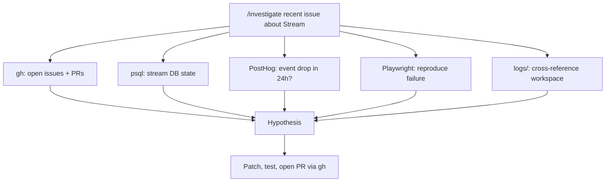

## Part 1: Mindset - What Is This Tool, Really?

### It's Not Just a Coding Agent

This is the biggest misconception. Claude Code runs a **general-purpose LLM** underneath; it just happens to have great tool integrations for code.

Use cases I've personally used it for outside of coding:
- Researching medical reports and recommending a course of action for a family member
- Building a personal finance dashboard
- Drafting legal research summaries
- Writing blog posts (meta!)

**Don't self-limit.** If a task requires thinking, reasoning, and structured output, this tool can handle it. Build tools for yourself. Measure your own finances. Research decisions that matter.

### The Core Mental Model

> *"A smart human with all the tools available, but limited context about your specific situation."*

Better clarity = better execution. Every ambiguity you leave in the prompt is a decision the model makes for you. It might make the wrong one.

This mental model governs everything else in this post. Keep it in mind.

## Part 2: Communication Foundation - How to Talk to It

### Why Always `.md`?

Every time I say "save it as a file," I mean `.md`. Here's why:

- **LLM-native format**: Markdown has minimal overhead and structured formatting that models parse efficiently
- **Human-readable**: You can open it, scan it, edit it without special tooling
- **Token-efficient**: Less syntax noise than XML or JSON; more signal per token

XML works too, and is actually ideal for prompting *within* a message. But for *files*, `.md` wins.

### XML Tags in Prompting

When writing complex prompts, use XML tags to give structure:

```xml
<context>
  You are reviewing a pull request for an AI legal research tool.
</context>

<task>
  Identify any security vulnerabilities in the auth middleware.
</task>

<constraints>
  Focus only on the files changed in this PR. Do not suggest refactors.
</constraints>
```

Models (especially Claude) are trained to parse XML structure well. It removes ambiguity, separates concerns, and makes long prompts much more reliable.

### Give Links, Not Just Instructions

Don't just describe what you want. Give it **authoritative references**. Web search is built into Claude Code. Tell it to:
- Search for best practices before implementing
- Pull the latest docs for a library before writing code against it

Example: When writing a Claude Code skill file, I give it a link to [Anthropic's own prompt engineering best practices](https://docs.claude.com/en/docs/build-with-claude/prompt-engineering/overview). It uses that to produce a prompt that's minimal, structured, and actually effective.

### Teach It Once: CLAUDE.md and Memory

The naive loop is re-explaining your preferences every session: "use tabs, don't leave comments, here's how our auth works." The power-user loop is to teach it once and never again.

Claude Code reads a `CLAUDE.md` file at the root of your project (plus a global one at `~/.claude/CLAUDE.md`) at the start of every session. Treat it as the agent's long-term memory:
- **Conventions**: your stack, your naming, your "never do X" rules
- **Project facts that aren't obvious from the code**: which environment points where, what a domain term means, who owns what
- **Hard-won corrections**: every time the agent gets something wrong, don't just fix it in the moment, write the rule down

That last point is the real unlock. When the agent makes a mistake, I don't treat it as a one-off correction, I treat it as a missing memory entry. It assumed a capability existed that didn't? Add a rule: *"verify behavior against the source before claiming it exists, never infer."* Now that mistake never recurs, in any future session.

This is meta-learning with a text file. The model doesn't get smarter, but your *configuration* of it does. Over weeks, a good `CLAUDE.md` turns a general assistant into something that already knows your codebase, your constraints, and your scars. The mistakes become training data instead of recurring annoyances.

## Part 3: Core Workflow - Day-to-Day Usage

### Plan Mode - Stay in the Driver's Seat

Plan Mode is now a first-class feature in current Claude Code: hit `Shift+Tab` to toggle it, no workarounds needed. I keep my install on the latest version specifically so I get features like this early (more on that in [Stay Updated](#stay-updated---the-early-adopter-edge)).

**For general models (Sonnet 4.6, Haiku 4.5):** Always use Plan Mode before letting the agent execute. These models benefit heavily from an explicit planning step before touching code.

**For powerful models (Opus 4.8):** They reason through medium-complexity tasks naturally; you may not always need to force Plan Mode. But for large or ambiguous tasks, still invoke it.

**How to use Plan Mode well:**
- Don't just hit "plan" and walk away. **Minimize the plan surface**: ask it to ask you clarifying questions first, so you stay involved before any implementation begins.
- Your plan should be crystal clear in *your* mind before the agent starts. If it isn't, keep refining.
- **Save the plan externally**: Claude Code saves plans internally, but also ask it to write the plan to a dedicated `.md` file (e.g., `plans/feature-x.md`). If the context window fills up or you clear the chat, start a new session and just say *"implement this plan"* and pick up exactly where you left off.

Even for bug fixes, Plan Mode keeps you in the loop. Never let it go fully autonomous on something you haven't mentally approved.

**A prediction:** this may matter less over time. You can already see the trajectory in the split above, the more capable the model, the less it needs planning forced on it. As models get better at holding a complex task in their head and reasoning before they act, explicit Plan Mode may fade from a necessity into a fallback you reach for only on genuinely ambiguous work. The durable skill isn't "always plan," it's *knowing how much steering this particular model needs.*

### Terminal Logs as Context - The Root Cause Shortcut

When debugging, don't paste raw logs into the chat. Instead:

1. Pipe your terminal output to a `.md` or `.txt` file in a `logs/` folder
2. Reference the file: *"Check `logs/server.md` and tell me why X is happening"*
3. The model reads it with full context (no truncation, no copy-paste errors)

This gets you to root cause almost every time. Structured log files are significantly more useful than wall-of-text chat pastes.

## Part 4: Scale and Power Patterns - When You Level Up

### Context and Multi-Session Strategy

**The biggest naive mistake:** Running one massive chat until you hit the context limit, then panicking.

**The right mental model:** Think of each chat as a *focused session*, not an infinite thread.

**Rules:**
- New topic -> new chat
- Need a fresh perspective on a problem -> new chat
- Approaching context limits -> new chat

**How to hand off between sessions:**
1. In the current chat, ask it to dump a context summary to a `.md` file
2. In the new chat, reference that file: *"Read `context/session-2.md` and continue from there"*

**Multi-chat collaboration:** Your sessions should work *together*. One chat does research and dumps findings. Another picks up and implements. A third reviews. Treat them like a team of specialists, not one overloaded generalist.

### Worktrees - Let It Work While You're Away

Claude Code supports [**git worktrees**](https://git-scm.com/docs/git-worktree), isolated copies of your repo in separate branches.

This means you can:
- Kick off a long-running agentic task in a worktree
- Walk away, do something else, come back when it's done
- Review the diff in isolation without affecting your main branch

Use this for tasks where you know the goal but don't need to babysit: refactors, test generation, boilerplate scaffolding.

### Power User Workspace - Beyond the Code Repo

Most devs just point Claude at their code repo. Power users build a **separate workspace repo** alongside it.

**Structure example:**
```
workspace/
├── docs/          # architecture notes, decisions, RFCs
├── scripts/       # DB migration scripts, Slack dump scripts
├── plans/         # saved planning docs
├── logs/          # terminal logs
└── context/       # meeting notes, stakeholder context
```

This workspace can be its own git repo, committed separately from code. Now you can say:
- *"Go to `docs/architecture.md` and suggest what needs to change for this feature"*
- *"Run the script in `scripts/slack-dump.sh` and summarize the feedback"*

The power is that **Claude operates across technical and non-technical decisions**, not just code changes, but architectural choices, feature allocation, team planning. The workspace is the connective tissue.

## Part 5: Meta - The Bigger Picture

### Skills and Subagents - Specialize and Parallelize

**Skills** are custom slash commands you define in `.claude/skills/`. Each skill is a `.md` file with a prompt that Claude executes when you invoke it.

Why they matter: instead of re-explaining a complex workflow every time, you encode it once. `/review-pr`, `/weekly-plan`, `/commit`: one word triggers a fully structured, repeatable process.

Use skills for any specialized, repeatable task: code reviews, changelog generation, planning docs, deployment checklists. Anything you find yourself describing from scratch more than twice should be a skill. In my own setup these aren't hypothetical: I have skills like `changelog-creator`, `slack-composer`, and `weekly-planner` that each encode a whole company-specific workflow into one command.

**You don't have to write every skill yourself.** Skills also ship as installable plugins, and I lean on two heavily. [**superpowers**](https://github.com/obra/superpowers) gives me disciplined workflow skills: brainstorming, test-driven development, systematic debugging, plan-writing. [**gstack**](https://github.com/garrytan/gstack) (Garry Tan's setup) adds a headless browser plus QA, design-review, and ship/deploy skills. Installed skills behave exactly like your own: one slash command, fully structured execution. The win is that you inherit other people's hard-won workflows instead of reinventing them.

**Subagents** are where things get powerful. Claude Code can spawn subagents, each one gets its own fresh context window and runs independently.

The key insight: context efficiency at scale. Instead of doing five PR reviews in one chat and blowing up your context, you tell Claude to spawn one subagent per PR and review them all in parallel. I do this regularly. The main agent orchestrates, each subagent does its job, results come back summarized.

Practical example: you have 6 open PRs on a Friday. You say "review all open PRs in parallel, spawn one subagent per PR, flag anything critical." Six parallel reviews, done in the time one would take, with zero context bleed between them.

### Permissions and Running Headless

Claude Code asks for permission before taking actions: running bash commands, editing files, calling tools. This is good by default. But it breaks down the moment you want Claude to run unattended.

**`settings.json`** (at `~/.claude/settings.json`) lets you pre-approve tools you trust. You define `allowedTools` and Claude stops asking for those.

**`--dangerously-skip-permissions`** is the flag you pass when you want Claude to run completely headless, with no prompts at all. The name is honest. Use it deliberately.

Where it shines: **tmux**. Spin up a tmux session, start Claude with `--dangerously-skip-permissions`, give it a task, detach. Claude runs, makes decisions, finishes. You come back to a completed diff. Pair this with [worktrees](#worktrees---let-it-work-while-youre-away) and you have a proper async agent: isolated branch, headless execution, nothing blocking it.

The pattern I use: tmux session per task, worktree per session, permissions skipped. Claude works while I work on something else.

### Guardrails: Bound the Blast Radius, Then Grant Autonomy

Skipping permissions only works if the dangerous paths aren't reachable in the first place. The point isn't to trust the agent more, it's to make the irreversible operations impossible to hit by accident. The safest guardrail is the one the agent *can't* cross even if it tries.

How I bound the blast radius before handing over autonomy:
- **Keep production out of reach.** The agent works against local and staging only. It never holds production database URLs, deploy keys, or live secrets. If it can't connect to prod, it can't break prod.
- **Don't hand it real credentials.** Anything the agent can read should be treated as potentially logged or echoed, so agent-readable config gets scoped, non-production values.
- **Route irreversible actions through humans.** Migrations, releases, and destructive operations go through your normal reviewed pipeline, never an autonomous agent run.
- **Make the safe path the only path.** When the irreversible 5% is fenced off by construction, you can grant broad autonomy on the other 95% without losing sleep.

The principle: agentic speed comes from a *bounded* blast radius, not from trusting the agent more. You move fast everywhere else precisely because the things you can't undo were never on the table.

### CLI > MCP (for context efficiency)

Both CLI and [MCP](https://modelcontextprotocol.io) ultimately call the same underlying API, so the difference isn't network speed. The real cost of MCP is **context window pollution**.

Most MCP clients load the full schema of every tool a server exposes into context upfront. Connect a few servers, each with dozens of tools, and you've burned tens of thousands of tokens before any real work begins. Anthropic's own engineers [make exactly this point](https://www.anthropic.com/engineering/code-execution-with-mcp#:~:text=Most%20MCP%20clients%20load%20all%20tool%20definitions%20upfront): "most MCP clients load all tool definitions upfront directly into context," and that cost grows with every tool you connect. In one of their examples, loading only the tools actually needed cut a workflow from 150,000 tokens to 2,000, a **98.7% reduction**.

A CLI call, by contrast, costs a couple hundred tokens of command syntax, and the tool schemas never enter your context at all.

CLI isn't faster at the network level. It's faster at the **context level**. MCP eats your reasoning budget.

### Stay Updated - The Early Adopter Edge

The compounding advantage of AI tooling is real. Check changelogs regularly:

- **Claude Code**: Anthropic ships features fast
- **Cursor**: new agent features drop often
- **Gemini CLI, OpenAI Codex CLI**: competition drives rapid iteration

New features often come with **free beta credits or extra usage**. Early adopters get to experiment at no cost and build familiarity before it becomes table stakes.

What feels like a power-user trick today is a baseline expectation in 6 months.

## The Demo: Claude as Orchestrator

This is where everything clicks together. I have a custom skill called `/investigate`.

```
/investigate recent issue about Stream
```

Claude doesn't ask what that means. It goes to work:

1. **`gh`**: searches open issues and recent PRs touching the Stream module
2. **`psql`**: queries the database to check stream state
3. **PostHog CLI**: checks if stream-related events dropped in the last 24 hours
4. **Playwright**: opens the app, navigates to the stream flow, reproduces the failure
5. **Reads logs**: cross-references the `logs/` folder from the workspace
6. **Patches and ships**: writes the fix, runs tests, opens a PR via `gh`

One natural language command. Six tools. A resolved issue.



This is Claude acting as the engineer: gathering evidence from multiple systems, forming a hypothesis, and shipping a fix. The skill is the entry point. The tools are the hands.

This is what "Engineering the Vibe" actually means. Not autocomplete. Orchestration.
